<div align="center">


# ⚡ CAPTCHA FROM HELL ⚡
### *The Ultimate Satirical Human Verification Gauntlet*

[](https://developer.mozilla.org/en-US/docs/Web/JavaScript)
[](https://developer.mozilla.org/en-US/docs/Web/HTML)
[](https://tailwindcss.com/)
[](https://developer.mozilla.org/en-US/docs/Web/API/Web_Audio_API)
[](LICENSE)

<p align="center">
  Ten psychological and neuromotor trials engineered to separate genuine human biology from synthetic algorithms.
</p>

</div>

---

## 📋 Basic Details

* **Project Name**: Ragebait CAPTCHA From Hell
* **Team Name**: The Other Way
* **Team Members**:
  * **Team Lead**: Ramsankar B Komath — *Govt. Model Engineering College, Thrikkakara*
  * **Member 2**: Neel A Ved — *Govt. Model Engineering College, Thrikkakara*

---

## 💡 The Premise

### The Problem (that doesn't exist)
Standard CAPTCHAs are trivial. Checking *"I am not a robot"* or selecting traffic lights has become an effortless task that even elementary computer vision models solve in milliseconds. The human verification experience lacks stakes, suffering, and emotional friction.

### The Solution (that nobody asked for)
We engineered **CAPTCHA From Hell**: an unapologetically punishing, 11-stage gauntlet designed to test actual human biology. If your vocal cords waver during a continuous 80 dB scream, if your emotional resilience falters during a painful breakup simulation, or if you can't survive a 60 FPS Geometry Dash sprint, you are formally declared a synthetic algorithm.

---

## 📸 Gameplay & Trial Gallery

<div align="center">

| **Hellfire Title Screen** | **Stage 1: Screaming Decibel Verification** |
| :---: | :---: |
| 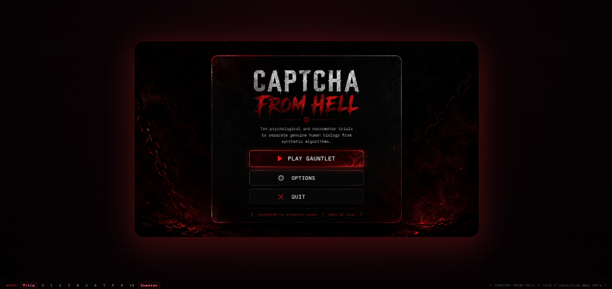 | 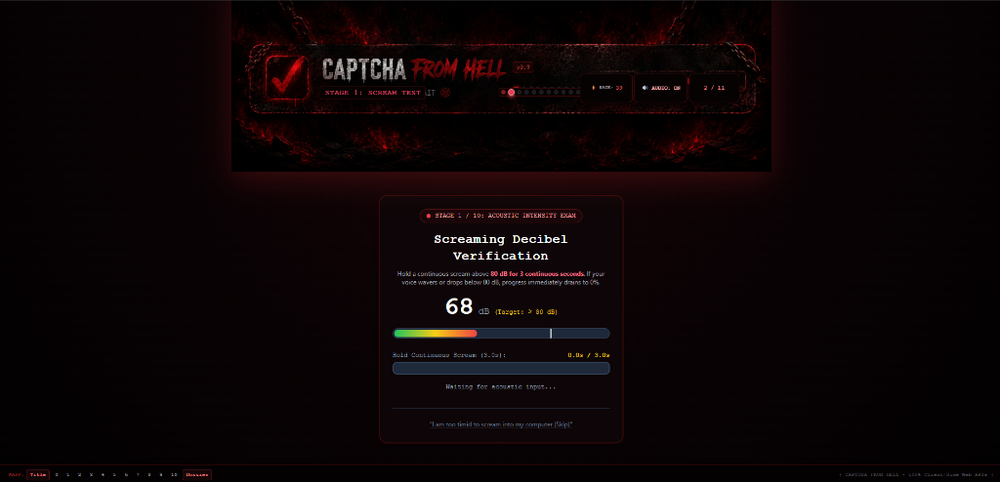 |

| **Stage 3: Ultra-Speed Whack-a-Mole** | **Stage 4: Breakup Simulator (Rias)** |
| :---: | :---: |
| 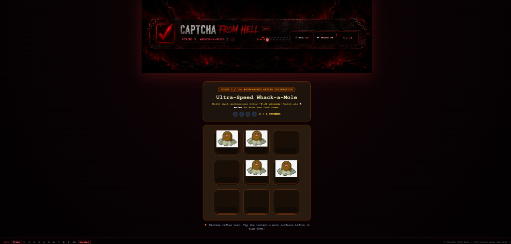 | 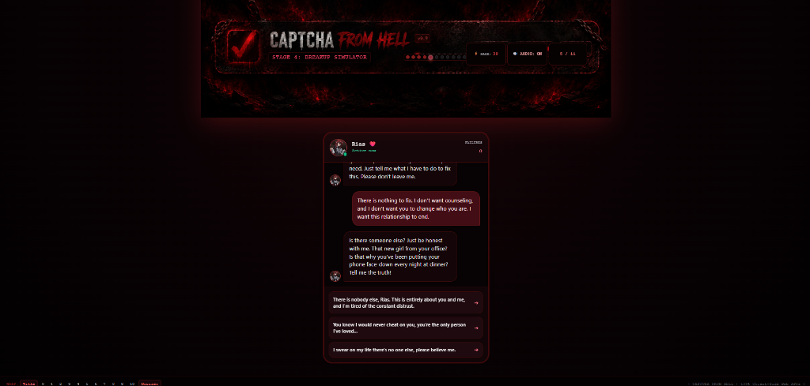 |

| **Stage 5: Minecraft Wither Battle (CPS Test)** | **Stage 6: Authentic Beacon Crafting** |
| :---: | :---: |
| 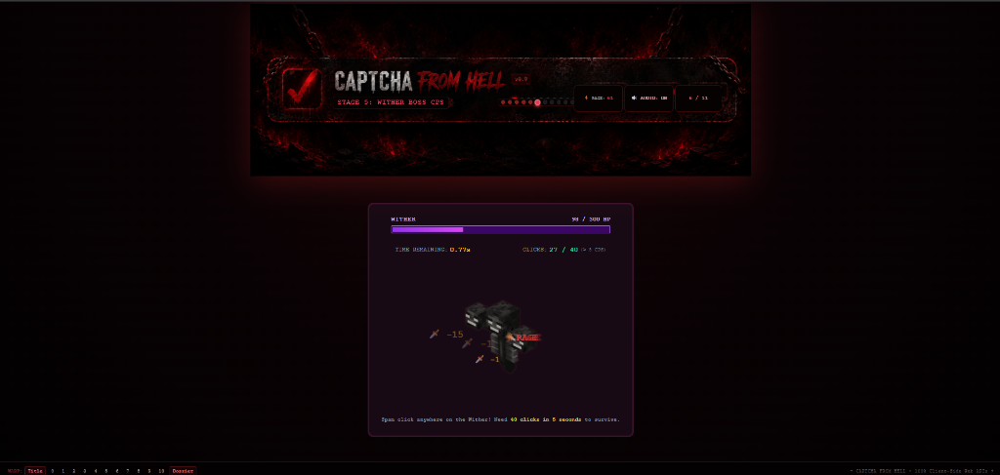 | 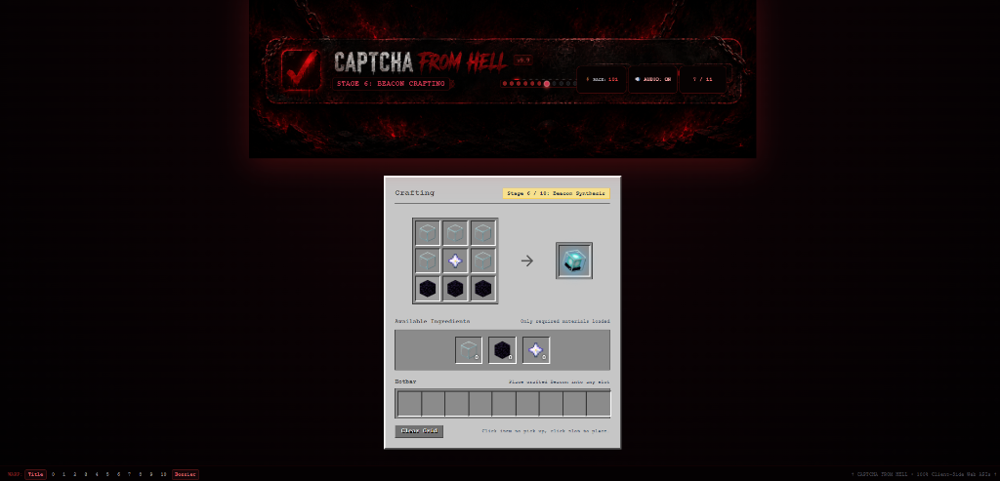 |

| **Stage 8: Moving Rim Free Throws** | **Stage 9: Stock Market Crash Terminal** |
| :---: | :---: |
| 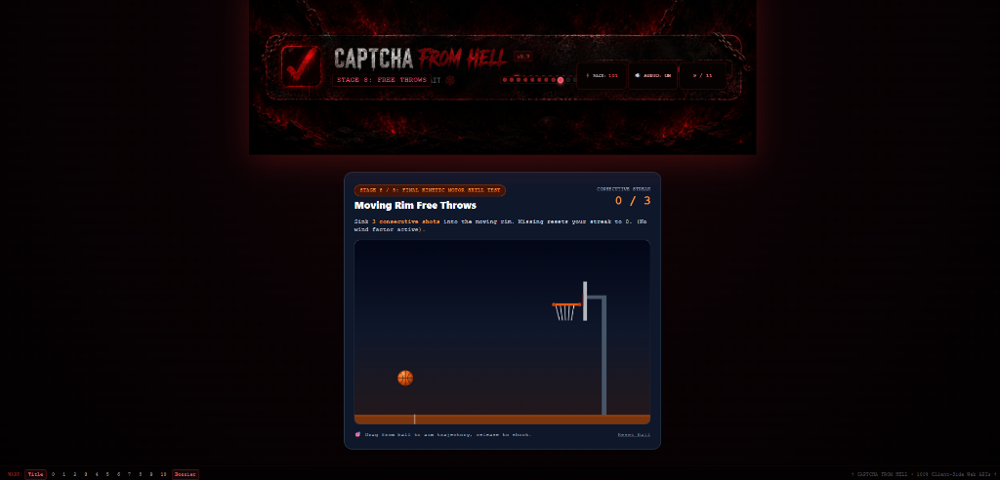 | 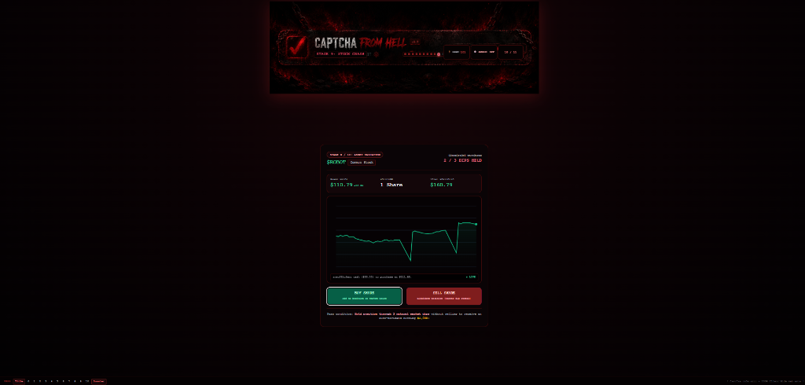 |

| **Stage 10: Geometry Dash Sprint** | **End Screen: Retro CRT Hardware Roast** |
| :---: | :---: |
| 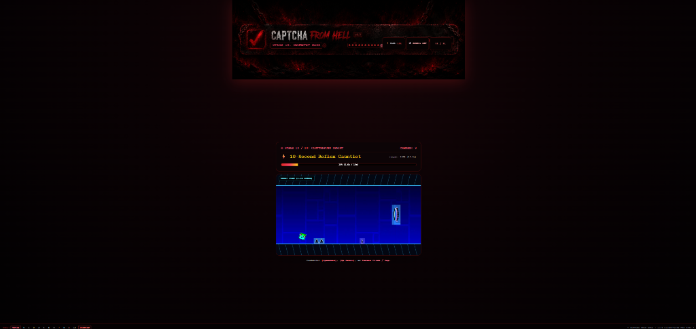 | 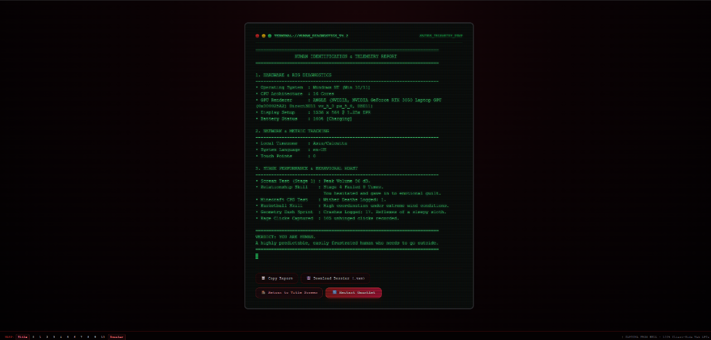 |

</div>

---

## 🎮 The 11-Stage Gauntlet

| Stage | Title | Biological Metric Tested | Mechanism & Pass Condition |
| :---: | :--- | :--- | :--- |
| **0** | **The Bait Checkbox** | Click Signature & Patience | Standard reCAPTCHA mock. Clicking flags your cursor signature as suspicious and locks you into the trials. |
| **1** | **Screaming Verification** | Acoustic Anguish (Mic) | Real-time FFT decibel analysis via `AudioContext.AnalyserNode`. Hold a scream $\ge 80\text{ dB}$ for 3 continuous seconds. Dropping below 80 dB resets progress to 0%. |
| **2** | **Affirmations Grid** | Ego & Consciousness | 4x4 randomized grid with 15 AI/toaster affirmations. Select the 1 authentic human statement. Picking a decoy triggers an error buzzer and reshuffles the grid. |
| **3** | **Ultra-Speed Whack-a-Mole** | Twitch Motor Latency | 4 hyper-speed moles darting across 9 holes every ~0.35s. Catch and stun all 4 moles simultaneously. |
| **4** | **Breakup Simulator** | Emotional Boundary Setting | Multi-branch messaging dialogue with AI partner **Rias**. Apologizing or wavering triggers reconciliation failure; only firm boundaries achieve separation. |
| **5** | **Minecraft Wither Battle** | Maximum Click Speed (CPS) | Nether arena CPS test. Land 40 sword clicks on the Wither within 4.0 seconds. Failure plays a custom rage scream sound effect. |
| **6** | **Authentic Beacon Crafting** | Native Game Knowledge | Zero recipe hints provided. Arrange 5 Glass, 1 Nether Star, and 3 Obsidian in a 3x3 Minecraft crafting grid and drag the Beacon to your hotbar. |
| **7** | **Human Happiness Exam** | Dopamine Calibration (Webcam) | Biometric facial HUD tracking smile emotion. Artificially capped at 14% dopamine to test human frustration limits. |
| **8** | **Moving Rim Free Throws** | Kinetic Trajectory Prediction | 2D vector arc slingshot physics. Shoot a basketball into a moving rim for 3 consecutive swishes. Missing resets streak to 0 with a custom fail scream. |
| **9** | **Stock Market Valuation** | Financial Panic Discipline | Real-time 2D Canvas trading terminal for `$ROBOT`. Hold your position through 3 market pullbacks without panic-selling to claim a $1,000 dividend. |
| **10** | **Geometry Dash Sprint** | Frame-Perfect Reflexes | 10-second side-scrolling gauntlet: 1.2x Cube Mode $\rightarrow$ Upside-Down Gravity Portal $\rightarrow$ 1.5x Mini-Cube $\rightarrow$ Ship Flight cavern. |

---

## 🕵️ 4th-Wall-Breaking CRT Telemetry Dossier
Upon surviving Stage 10, the application transitions into a 3-second diagnostic dump followed by a retro green phosphor CRT terminal that extracts real client-side telemetry:
* **GPU Architecture**: Unmasked graphics card renderer via `WEBGL_debug_renderer_info`.
* **Hardware Rig**: Logical CPU thread count (`navigator.hardwareConcurrency`) and battery metrics.
* **Display Forensics**: Physical resolution, color depth, and Device Pixel Ratio (DPR).
* **Behavioral Roast**: Aggregates peak scream decibels, breakup failures with Rias, Wither deaths, and total unhinged rage clicks.
* **Export Utilities**: One-click **Copy to Clipboard** and client-side **Download Dossier (.txt)** export.

---

## 🔄 Application Workflow

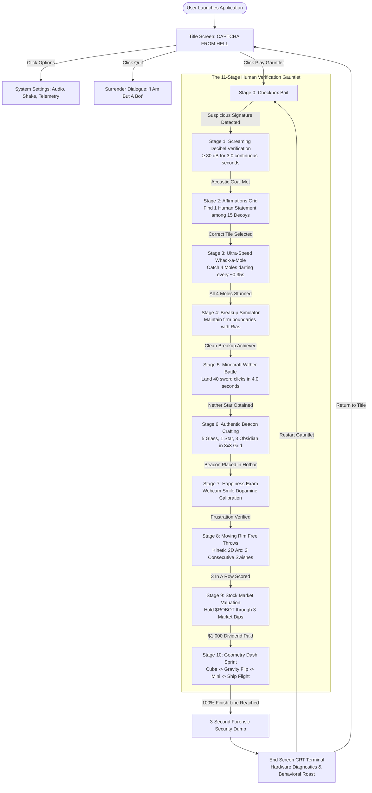

---

## 🛠️ Technology Stack

* **Front-End**: HTML5, CSS3 (PostCSS scanline shaders & CRT flicker animations)
* **Styling Framework**: Tailwind CSS (v3 via CDN)
* **Core Logic**: Vanilla JavaScript (ES6+ modular stage system, zero heavy runtime frameworks)
* **Audio Synthesis**: Web Audio API (`AudioContext`, `OscillatorNode`, `GainNode`, `BiquadFilterNode`, `AnalyserNode`)
* **Hardware & Sensor I/O**: WebRTC Media Streams (`navigator.mediaDevices.getUserMedia`)
* **Rendering**: HTML5 Canvas 2D Context (60 FPS kinetic physics & platformer loops)
* **Static Host Server**: PowerShell (v5.1+) `System.Net.HttpListener` (`server.ps1`)

---

## 📁 Repository Structure

```text
useless_project_temp/
├── index.html               # Main entry point & layout chassis
├── server.ps1               # Lightweight static PowerShell HTTP server
├── start_server.bat         # 1-click Windows runner script
├── vercel.json              # Vercel deployment & cache optimization config
├── README.md                # Project documentation & gameplay showcase
├── css/
│   └── styles.css           # Hellfire gradients, CRT monitor overlays, Minecraft UI, animations
├── assets/
│   ├── audio/
│   │   └── fail_custom.mp3  # Custom rage scream fail audio (Wither & Basketball misses)
│   ├── screenshots/         # In-game showcase screenshots
│   │   ├── screenshot_title.png
│   │   ├── screenshot_stage1_scream.png
│   │   ├── screenshot_stage3_mole.png
│   │   ├── screenshot_stage4_breakup.png
│   │   ├── screenshot_stage5_wither.png
│   │   ├── screenshot_stage6_beacon.png
│   │   ├── screenshot_stage8_basketball.png
│   │   ├── screenshot_stage9_stock.png
│   │   ├── screenshot_stage10_gd.png
│   │   └── screenshot_dossier_terminal.png
│   └── images/              # Custom sprites and wallpapers
│       ├── beacon.png, nether_star.png, obsidian.png, glass.png
│       ├── crafting_table_gui.jpg
│       ├── mole_normal.png, mole_stunned.png
│       ├── wither.png
│       ├── rias_pfp.png
│       ├── gd_cube.png, gd_ship.png, gd_spike.jpg, gd_double_spike.png
│       ├── gd_portal.png, gd_bg.jpg
│       ├── header_panel.png
│       └── title_screen.png
└── js/
    ├── state.js             # Global telemetry store (gameState) & stage catalog
    ├── audio.js             # Procedural Web Audio API sound engine (SoundEngine)
    ├── sprites.js           # Universal asset resolver (SVG strings & Canvas Image preloader)
    ├── app.js               # Main router, header overlay updater, title screen & CRT terminal
    └── stages/
        ├── stage0.js        # The Bait Checkbox
        ├── stage1.js        # Screaming Decibel Verification (AudioContext AnalyserNode)
        ├── stage2.js        # Affirmations Grid (Decoy randomization)
        ├── stage3.js        # Ultra-Speed Whack-a-Mole (4 moles, ~0.35s darting)
        ├── stage4.js        # Emotional Breakup Simulator (Rias dialogue tree)
        ├── stage5.js        # Minecraft Wither CPS Battle (40 clicks in 4.0s)
        ├── stage6.js        # Authentic Beacon Crafting (3x3 grid drag/click)
        ├── stage7.js        # Happiness Facial Emotion Exam (Webcam stream)
        ├── stage8.js        # Moving Rim Basketball Physics Engine
        ├── stage9.js        # Real-time Stock Market Terminal
        └── stage10.js       # Geometry Dash Clutterfunk Sprint (60 FPS Platformer)
```

---

## 🚀 Installation & Quick Start

### Option 1: One-Click Local Server (Recommended for Windows)
> [!NOTE]
> Running through a local server ensures your browser grants permission for microphone and webcam APIs.

Double-click `start_server.bat` or run in PowerShell:
```powershell
powershell -ExecutionPolicy Bypass -File .\server.ps1
```
Then open your browser to:
```
http://localhost:8080/
```

### Option 2: Deploy to Vercel (1-Click Cloud Deploy)
1. Push this repository to GitHub.
2. Go to **[vercel.com/new](https://vercel.com/new)** and import your repository.
3. Framework Preset: **Other** / **Static Site**, Root: `./`.
4. Click **Deploy**! (Vercel automatically provides HTTPS so Microphone and Webcam APIs work out-of-the-box).

### Option 3: Python 3 (Cross-Platform: Mac / Linux / Windows)
```bash
python -m http.server 8080
```
Then navigate to `http://localhost:8080/`.

### Option 4: Direct File Open
Double-click `index.html` to open directly in any modern browser (Chrome, Edge, Firefox, Brave).

---

## 🎯 Debug & Quick Warp
For rapid testing or reviewing specific stages, a discreet **WARP** debug bar is located at the bottom of the page:
* Click **`Title`** to return to the Hellfire Title Screen.
* Click numbers **`0`** through **`10`** to jump directly to any challenge.
* Click **`Dossier`** to test the final CRT Telemetry End Screen and hardware roast.

---

<div align="center">

† *CAPTCHA FROM HELL • 100% Client-Side Web APIs • Zero AI Slop* †

</div>
